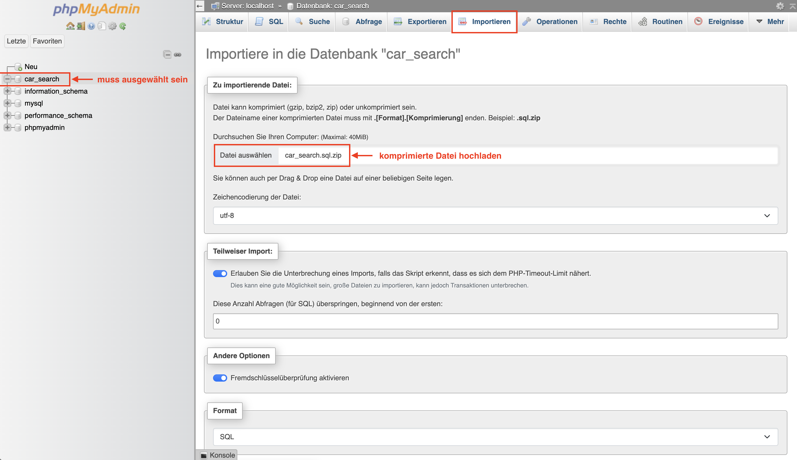
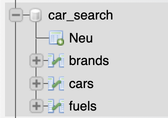

# Car-Search API

API für das Demo-Projekt "Fahrzeugsuche" im Zuge des Praxisworkshops an der DigiHAK Neumarkt.

**Inhalt:**

- [Car-Search API](#car-search-api)
  - [TECHNOLOGIEN](#technologien)
  - [DEV-SETUP](#dev-setup)
    - [Datenbank-Setup](#datenbank-setup)
      - [1. Datenbank erstellen](#1-datenbank-erstellen)
      - [2. Tabellen inkl. Daten importieren](#2-tabellen-inkl-daten-importieren)
      - [3. DB-config eintragen](#3-db-config-eintragen)
  - [DEV-URLS](#dev-urls)

## TECHNOLOGIEN

- php REST-API
- MVC Muster (Model View Controller)
- MySQL Datenbank

## DEV-SETUP

1. MAMP (= Apache WebServer + MySQL-Server) downloaden und installieren https://www.mamp.info/de/downloads

2. Apache Web Server Port auf `8080` ändern

3. MySQL-DB Port auf `3306` ändern

4. Postman (= API client) downloaden: https://www.postman.com/downloads/

### Datenbank-Setup

Am einfachsten geht das Setup via phpMyAdmin-Oberfläche (sie [phpMyAdmin](#dev-urls)).

#### 1. Datenbank erstellen

Eine neue Datenbank mit dem Namen `car_search` erstellen.

> Im ordner _sql_, in der Datei _database.sql_ ist das entsprechende SQL-Statement zum erstellen der Datenbank zu finden.

#### 2. Tabellen inkl. Daten importieren

- Datebank `car_search` auswählen
- in der oberen Menüleiste auf _Importieren_ klicken
- die KOMPRIMIERTE Datei _car_search.sql.zip_ (aus dem Ordner _sql_) hochladen
- auf "Importieren" klicken

Die Tabellen sollten nun angelegt und befüllt worden sein:

#### 3. DB-config eintragen

- Direkt im Root-Verzeichnis (auf der selben Ebene wie das `index.php`) eine neue Datei `config.php` erstellen.
- Den Inhalt aus der Datei _config.dist.php_ kopieren und die enstprechenden Werte für die eigene Datenbank eintragen.

## DEV-URLS

- Webserver: http://localhost:8080
- phpMyAdmin: http://localhost:8080/phpmyadmin/
- MySQL DB: Port 3306
